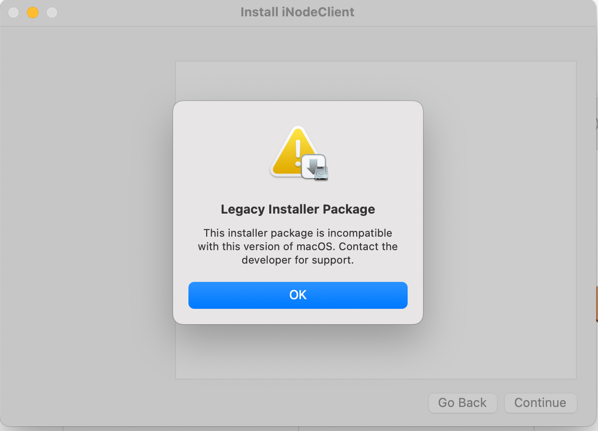
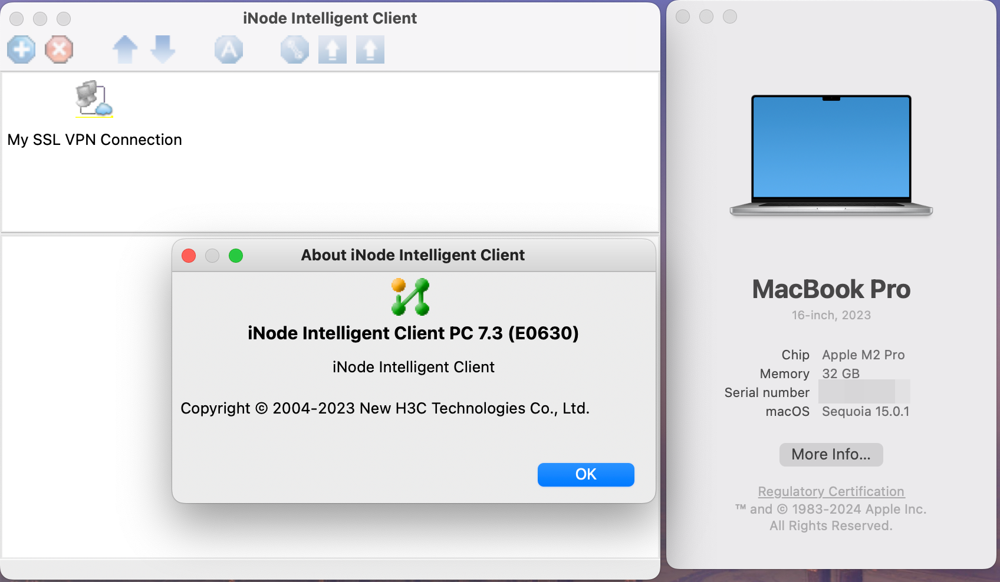

# H3C iNode

iNodeClient 无法在 macOS 15 上安装, 提示

将原 [PKG E0630](https://www.h3c.com/cn/Service/Document_Software/Software_Download/Intelligent_Management/iNode/iNode_PC/?CHID=56726&v=612) 文件中的 `iNodeClient.pkg` 重新由 [Packages](http://s.sudre.free.fr/Software/Packages/about.html) 重新封装为 pkg 包安装即可。

